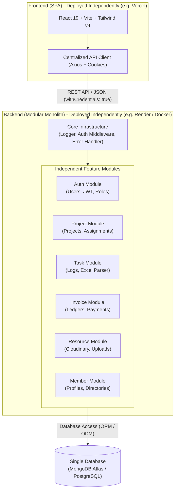

# Architectural Proposal & Implementation Plan: GT-Online

> **Document Purpose**: This document serves as a comprehensive proposal and architectural roadmap to share with the team. It outlines the transition from the **current codebase** to a standardized, containerized, and modular architecture that supports smooth collaboration between frontend and backend developers across different operating systems.

---

## 1. Context: Current Codebase vs. Proposed Additions

To establish a clear baseline between what currently exists in the original repository and what is being proposed:

### A. The Current Baseline (Current codebase)
- A standard monolithic directory containing `client/` (React + Vite) and `server/` (Node.js + Express + Mongoose).
- No containerization or standardized dev environments (manual setup prone to Windows vs. Linux quirks).
- A flat backend structure where routes, controllers, and models are grouped by technical layer rather than business domain.
- Missing route protections and duplicated state/auth contexts.

### B. Our Additions & Immediate Foundation (What We Have Added)
- **Containerization**: Added `Dockerfile`s for both `client/` and `server/`, `.dockerignore` files, and a root `docker-compose.yml` (configured to connect directly to the existing MongoDB Atlas database in `server/.env`).
- **Cross-Platform Compatibility**: Added `.gitattributes` to enforce consistent `LF` line endings across Debian 13 and Windows 11.
- **This Proposal (`suggestions.md`)**: A structured plan detailing repository separation, modular monolith organization, team protocols, and database recommendations.

---

## 2. Executive Summary: Modular Monolith + Decoupled SPA Frontend

While the other developer may lean toward keeping a simple monolith and you lean toward a modular design, the **Modular Monolith** provides the ideal middle ground:



### Why This Consensus Works
1. **Simplicity for the Monolith Advocate**: Single backend codebase, single deployment target, single database connection, and zero microservice network latency or distributed transaction complexity.
2. **Clarity for the Modular Advocate**: Clean, isolated domain boundaries (`modules/auth`, `modules/projects`, etc.) where features can be developed and debugged independently with module-scoped logging (`<module>:<level>:<message>`).
3. **Independent Deployability**: Frontend and Backend remain completely decoupled over REST APIs, allowing separate hosting (e.g., Vercel for UI, Render/Railway for API).

---

## 3. GitHub Organization & Repository Structure

### A. Dedicated GitHub Organization
To maintain separation from personal projects, establish a shared GitHub Organization (e.g., `gt-online-org` or `gtonlineconsults`):
- **Access Control**: Team members receive role-based permissions (Admins, Maintainers).
- **Branch Protection Rules**: Protect `main` — require PR reviews and passing CI checks before merging.
- **Project Boards & Issues**: Use GitHub Projects and Issue Templates to track frontend and backend deliverables.

### B. Proposed Repository Strategy

| Repository | Primary Lead | Tech Stack | Deployment Target |
| :--- | :--- | :--- | :--- |
| `gt-online-backend` | Developer 1 (Backend Lead) | Node.js (ESM), Express 5, Mongoose 9 / Prisma, PNPM | Render / Railway / Docker VPS |
| `gt-online-frontend` | Developer 2 (Frontend Lead) | React 19, TypeScript, Vite 8, Tailwind v4, PNPM | Vercel / Netlify |

*(Note: During initial development, keeping both in the current unified repository with Docker Compose is fully supported until the team is ready to split them into separate repositories.)*

---

## 4. Cross-Platform Reproducibility & Docker Setup

### A. Handling Debian 13 (Linux) vs Windows 11 Compatibility
Developing across Linux and Windows often introduces line ending and file permission quirks:

1. **Git Line Endings (`.gitattributes`)**:
   Enforces consistent `LF` line endings across all files to prevent Windows `CRLF` conflicts:
   ```gitattributes
   * text=auto eol=lf
   *.sh text eol=lf
   *.bat text eol=crlf
   *.cmd text eol=crlf
   ```
2. **Path Separators**: Use Node.js built-in `path.join()` or `path.resolve()` rather than hardcoded `/` or `\` in backend scripts.
3. **Environment Files**: Never commit `.env`. Provide complete, documented `.env.example` templates in both repositories.

### B. The Added Docker Compose Workflow

The added root `docker-compose.yml` reads directly from `server/.env` (connecting to your cloud **MongoDB Atlas** database) and `client/.env`, while supporting live-reloading on both Debian and Windows:

```yaml
services:
  # ---------------------------------------------------------------------------
  # 1. Backend API Service (Express.js)
  # Reads configuration directly from server/.env (including MongoDB Atlas URI)
  # ---------------------------------------------------------------------------
  server:
    build:
      context: ./server
      dockerfile: Dockerfile
    container_name: gt_server
    restart: unless-stopped
    ports:
      - "${PORT:-3001}:3001"
    env_file:
      - ./server/.env
    volumes:
      - ./server:/app
      - /app/node_modules
    networks:
      - gt_network

  # ---------------------------------------------------------------------------
  # 2. Frontend Client Service (React + Vite)
  # Reads configuration directly from client/.env
  # ---------------------------------------------------------------------------
  client:
    build:
      context: ./client
      dockerfile: Dockerfile
    container_name: gt_client
    restart: unless-stopped
    ports:
      - "5173:5173"
    env_file:
      - ./client/.env
    environment:
      - VITE_BASE_URL=http://localhost:3001
    volumes:
      - ./client:/app
      - /app/node_modules
    depends_on:
      - server
    networks:
      - gt_network

  # ---------------------------------------------------------------------------
  # 3. Optional Local MongoDB Database (for offline development / testing)
  # ---------------------------------------------------------------------------
  mongo:
    image: mongo:7.0
    container_name: gt_mongo
    restart: unless-stopped
    ports:
      - "27017:27017"
    environment:
      MONGO_INITDB_DATABASE: gtonline
    volumes:
      - mongo_data:/data/db
    networks:
      - gt_network
    profiles:
      - local-db

  # ---------------------------------------------------------------------------
  # 4. Optional Mongo Express Web GUI (http://localhost:8081)
  # ---------------------------------------------------------------------------
  mongo-express:
    image: mongo-express:latest
    container_name: gt_mongo_express
    restart: unless-stopped
    ports:
      - "8081:8081"
    environment:
      ME_CONFIG_MONGODB_SERVER: mongo
      ME_CONFIG_MONGODB_PORT: 27017
      ME_CONFIG_MONGODB_ENABLE_ADMIN: "true"
      ME_CONFIG_BASICAUTH: "false"
    depends_on:
      - mongo
    networks:
      - gt_network
    profiles:
      - local-db

# ---------------------------------------------------------------------------
# Networks and Volumes
# ---------------------------------------------------------------------------
networks:
  gt_network:
    driver: bridge

volumes:
  mongo_data:
    driver: local
```

#### Running the Setup:
- **Default (Connects to Atlas Cloud MongoDB from `.env`)**:
  ```bash
  docker compose up --build
  ```
- **Offline / Local Database Mode**:
  ```bash
  docker compose --profile local-db up --build
  ```

---

## 5. Modular Monolith Architecture & Independent Debugging

### A. Proposed Backend Directory Structure (Feature-Based Modules)
Refactor the flat `controllers/`, `routes/`, and `models/` folders into self-contained domain modules:

```
server/
├── Dockerfile
├── package.json
├── index.js                     # Application entry & module registration
├── core/                        # Shared infrastructure only
│   ├── config/
│   │   ├── db.js                # Database connection with proper async/await
│   │   └── cloudinary.js        # Cloud storage setup
│   ├── middleware/
│   │   ├── auth.middleware.js   # JWT verification & role validation
│   │   ├── error.middleware.js  # Global error handling
│   │   └── upload.middleware.js # Multer configuration
│   └── utils/
│       ├── logger.js            # Standardized module-scoped logger
│       └── cookie.js            # Secure cookie options helper
│
└── modules/                     # Independent Domain Modules
    ├── auth/
    │   ├── auth.routes.js
    │   ├── auth.controller.js
    │   ├── auth.service.js
    │   └── auth.validator.js
    │
    ├── members/
    │   ├── member.routes.js
    │   ├── member.controller.js
    │   ├── member.service.js
    │   └── member.model.js
    │
    ├── projects/
    │   ├── project.routes.js
    │   ├── project.controller.js
    │   ├── project.service.js
    │   ├── project.model.js
    │   └── projectAssignment.model.js
    │
    ├── tasks/
    │   ├── task.routes.js
    │   ├── task.controller.js
    │   ├── task.service.js
    │   ├── task.model.js
    │   └── excel.service.js     # Excel parsing logic
    │
    ├── invoices/
    │   ├── invoice.routes.js
    │   ├── invoice.controller.js
    │   ├── invoice.service.js
    │   └── invoice.model.js
    │
    └── resources/
        ├── resource.routes.js
        ├── resource.controller.js
        ├── resource.service.js
        └── resource.model.js
```

### B. Standardized Module Logging Format (`<module>:<level>:<message>`)

Every module uses a dedicated logger prefix to ensure logs can be filtered and debugged independently:

```javascript
// Example output:
// [AUTH:ERROR] Invalid refresh token provided
// [TASKS:INFO] Parsed 42 rows from uploaded Excel spreadsheet
// [INVOICES:WARN] Missing hourly rate for member ID 64b8f...
```

#### Logger Implementation Helper:
```javascript
// core/utils/logger.js
export const createLogger = (moduleName) => ({
  info: (msg, data = "") => console.log(`[${moduleName.toUpperCase()}:INFO] ${msg}`, data),
  warn: (msg, data = "") => console.warn(`[${moduleName.toUpperCase()}:WARN] ${msg}`, data),
  error: (msg, err = "") => console.error(`[${moduleName.toUpperCase()}:ERROR] ${msg}`, err?.message || err),
  debug: (msg, data = "") => {
    if (process.env.NODE_ENV === "development") {
      console.debug(`[${moduleName.toUpperCase()}:DEBUG] ${msg}`, data);
    }
  }
});
```

---

## 6. Separation of Concerns & Collaboration Protocol

To ensure both developers work smoothly without conflicting changes:

```
 Developer A (Backend Lead)               Developer B (Frontend Lead)
 ─────────────────────────               ───────────────────────────
 • Owns modules/ & core/                 • Owns routes/, components/, layout/
 • Designs API specifications            • Consumes API contracts
 • Implements DB schemas                 • Builds responsive UI & state
 
 When working on Frontend:               When working on Backend:
 • Only works on assigned Page/Route     • Only works within an assigned Module
 • Uses existing API services layer      • Adheres to module structure & DTOs
```

### A. API Contract as the Source of Truth
1. Before implementing a feature, write down the endpoint contract:
   - **Route**: `POST /api/v1/projects/:id/assign`
   - **Request Headers & Body Schema**: `{ taskerIds: string[] }`
   - **Response Format (Standardized)**:
     ```json
     // Success Response
     {
       "success": true,
       "data": { ... },
       "message": "Operation successful"
     }

     // Error Response
     {
       "success": false,
       "error": {
         "code": "PROJECT_NOT_FOUND",
         "message": "Project with the specified ID does not exist"
       }
     }
     ```
2. Frontend can mock the response while backend is in progress, allowing parallel work.

### B. Rules for Cross-Working
1. **Frontend Isolation**:
   - Centralize all API calls in a typed service directory (e.g. `src/services/project.service.ts`).
   - If Developer A builds a frontend page, they only write the route component and call existing API services without editing global state or layout configs.
2. **Backend Isolation**:
   - If Developer B implements an API, they work strictly within `modules/<feature>/` without touching other modules or global core middleware.
3. **No Direct Inter-Module Database Queries**:
   - A module should never directly import and query another module's database model if it involves business logic. It should invoke that module's exported service function instead.

---

## 7. Database Recommendation: Relational (PostgreSQL) vs Document (MongoDB)

While the original codebase connects to **MongoDB Atlas**, a comparative evaluation reveals strong technical grounds to consider a **Relational Database (PostgreSQL)**:

### A. Comparative Analysis

| Evaluation Metric | MongoDB (Current) | PostgreSQL (Recommended Relational DB) |
| :--- | :--- | :--- |
| **Financial & Ledger Consistency** | Requires manual application-level transaction handling to keep invoices, hours, and pay rates synchronized. | **Native ACID Compliance & Constraints**: Prevents arithmetic discrepancies, partial writes, or double-entry mistakes. |
| **Data Relationships & Referential Integrity** | Relies on manual ObjectIds and simulated `.populate()` queries. Deleting a Project or User can leave orphaned assignments or invoices unless manually cleaned up. | **Foreign Key Cascades & Constraints**: Native `ON DELETE CASCADE` or `RESTRICT` guarantees zero orphaned records. |
| **Complex Queries & Aggregations** | Requires verbose, multi-stage MongoDB Aggregation Pipelines to calculate total earnings, hours per project, and balance ledgers. | **Standard SQL Joins & Window Functions**: Fast, declarative aggregation across `Users`, `Projects`, `Tasks`, and `Invoices`. |
| **Type Safety & Migrations** | Mongoose schemas are loose and checked only at runtime. Schema migrations are manual. | **TypeScript-Native ORM (Prisma / Drizzle)**: Generates type definitions directly from the database schema with deterministic versioned migrations. |

### B. Recommendation & Pragmatic Path Forward

1. **Short-Term (Launch MVP Fast)**:
   - Continue with the existing **MongoDB Atlas** setup.
   - Refactor queries into the modular structure (`modules/*/service.js`).
   - Add strict Mongoose validation and transaction blocks around invoice/financial operations.

2. **Medium-to-Long Term (Production Scale)**:
   - Migrate to **PostgreSQL** (hosted on Supabase, Neon, or Railway) using **Prisma ORM** or **Drizzle ORM**.
   - This provides end-to-end type safety between database tables and Express controllers, eliminating bugs around missing fields or invalid relations.

---

## 8. Phased Implementation Roadmap

### Phase 1: Foundation & Standardization (Completed in this Branch)
- [x] Create standardized `Dockerfile` for backend and frontend.
- [x] Create root `docker-compose.yml` integrated with `server/.env` (MongoDB Atlas).
- [x] Add `.gitattributes` to normalize line endings across Debian and Windows.
- [x] Author comprehensive architectural proposal & team guidelines (`suggestions.md`).

### Phase 2: Backend Modularization & Security Hardening
- [ ] Refactor folder layout into feature-based `modules/` (`auth`, `projects`, `tasks`, `invoices`, `resources`, `members`).
- [ ] Implement `createLogger` and replace raw `console.log` with `[MODULE:LEVEL]` logs.
- [ ] Protect all administrative endpoints with `protect` middleware and role checks.
- [ ] Fix database connection logic in `core/config/db.js` (ensure proper `await mongoose.connect`).
- [ ] Remove empty stubs / dead code.

### Phase 3: Frontend Refactor & API Service Centralization
- [ ] Create a centralized Axios client instance with base URL and `withCredentials: true`.
- [ ] Remove redundant/conflicting auth context (`src/context/AuthContext.tsx`).
- [ ] Fix `vite.config.ts` path alias configuration.
- [ ] Align UI routes with backend modular endpoints.

### Phase 4: Organization Setup & Independent Deployment
- [ ] Create the GitHub Organization and split into `gt-online-backend` and `gt-online-frontend` repositories.
- [ ] Set up GitHub Actions for automated linting (`oxlint` / `eslint`) and type checking on PRs.
- [ ] Connect `gt-online-backend` to Render/Railway with environment secrets.
- [ ] Connect `gt-online-frontend` to Vercel/Netlify with `VITE_BASE_URL` pointing to the deployed backend.
- [ ] Verify CORS and cookie cross-domain policies in production.
